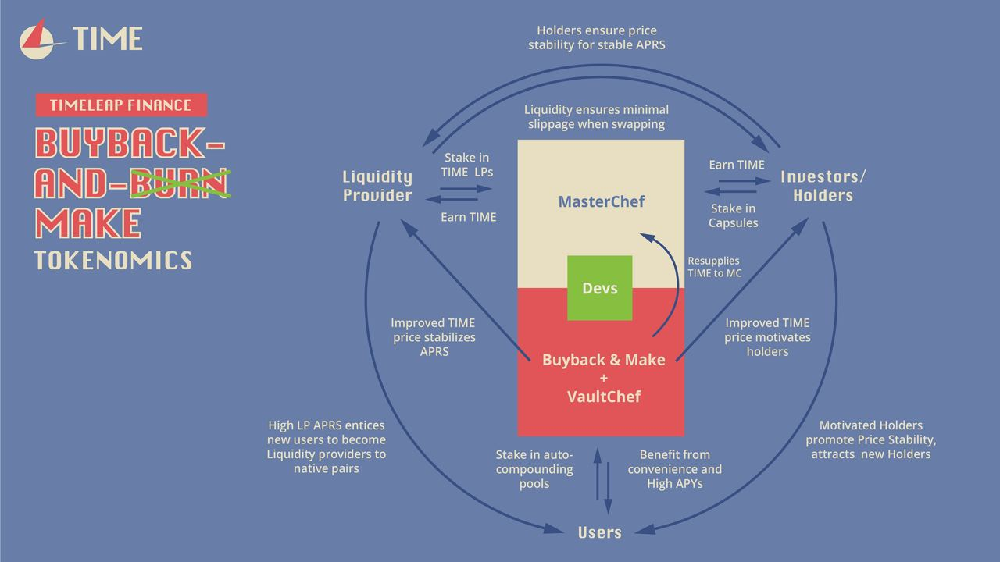

# README

---

## Scope

## Introduction

- We use version v3.1.0 of OpenZeppelin libraries
- Solidity compiler version is specified as 0.6.12

## Ecosystem

## Contracts

### Farm

Base Contracts

- TimeToken.sol - [`0x5c59d7cb794471a9633391c4927ade06b8787a90`](https://polygonscan.com/token/0x5c59d7cb794471a9633391c4927ade06b8787a90)
- MasterChef.sol - [`0x41c4dfa389e8c43ba6220aa62021ed246d441306`](https://polygonscan.com/address/0x41c4dfa389e8c43ba6220aa62021ed246d441306)
- SafeOwner.sol - [`0x02e6AED3D464490b39295626a39bffDA17D679A9`](https://polygonscan.com/address/0x02e6AED3D464490b39295626a39bffDA17D679A9)
- Timelock.sol - [`0x0bd5d1f205c593f4587f54b131ef86b1b026976d`](https://polygonscan.com/address/0x0bd5d1f205c593f4587f54b131ef86b1b026976d)

See [audits completed by Paladin](https://paladinsec.co/projects/timeleap-finance/).

### Vaults

Each vault comprises of a separate contract.
Please refer to the [Paladin audit for Vaults](https://paladinsec.co/projects/timeleap-finance/) for more information.

### Treasury

- TimeTreasury.sol - [`0x374BD17C475f972D6aF4EA0fAC0744B5500A959F`](https://polygonscan.com/address/0x374bd17c475f972d6af4ea0fac0744b5500a959f)
- TimeTreasuryTimelock.sol - [`0xb571bAF1D6916146F047505D4fc5d4d7595C061a`](https://polygonscan.com/address/0xb571baf1d6916146f047505d4fc5d4d7595c061a)

Any new contracts that are published on the blockchain will be added above.
Please review our [documentation](https://docs.timeleap.finance) for more information about our roadmap.
